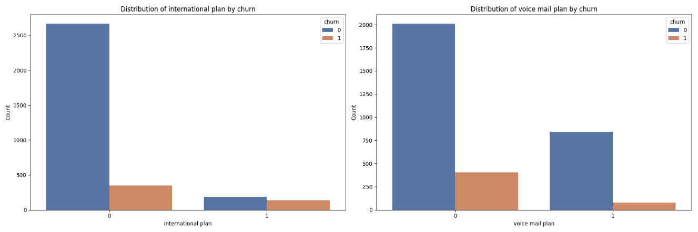

# Customer Churn Prediction for SyriaTel Telecom

Author: Rose Muthini

## Overview
Loss of existing customers is a major challenge for telecommunications companies like SyriaTel. Acquiring new customers is often more costly than retaining current ones, and high churn rates negatively impact revenue, profitability, and market share. This project aims to leverage historical customer data to predict churn, enabling SyriaTel to take proactive measures that improve customer retention, satisfaction, and competitive positioning.

## Business Understanding
### Stakeholders
SyriaTel Telecommunications Company.

### Business problem
SyriaTel is experiencing significant customer churn, leading to revenue loss and declining market share. Without a clear understanding of churn patterns and high-risk customer segments, the company struggles to develop effective retention strategies.

To address this, the project will:

Predict which customers are likely to churn.

Identify the most important factors driving churn.

Deliver actionable insights to support targeted retention campaigns and improve overall customer loyalty.

## Data Understanding
The dataset in use was obtained from [kaggle](https://www.kaggle.com/datasets/becksddf/churn-in-telecoms-dataset?resource=download). It contains SyriaTel telecom customers' information such as:
1.International plan.
2. Account length.
3. Voicemail plan.
4. Number of voicemail messages.
5. Total day, evening and night calls, charges and minutes.
6. Customer service calls.
7. Churn. Whether a customer left or not.

### a) Distribution of international and voicemail plans by churn

**Insights:**
International plan by churn
Most customers don’t have an international plan, and churn is relatively low among them. However, churn is higher among those with the plan, suggesting a link between having the plan and increased likelihood of churn.

Voice mail plan by churn
Most customers don’t have a voice mail plan, and while many didn’t churn, a significant number did. Those with a voice mail plan are fewer, but they show a lower churn rate, indicating they are less likely to churn.
### b) Relationship between churn and columns with numerical data

**Insights:**
Total minutes vs churn
Non-churned customers tend to have slightly lower total minutes. Churned customers show a wider range and higher median, suggesting high usage may contribute to churn, possibly due to cost.

Total calls vs churn
Distributions are similar across churned and non-churned groups, indicating total calls may not be a key churn indicator.

Total charge vs churn
Non-churned customers have lower, more consistent charges. Churned customers face higher and more varied charges, pointing to possible dissatisfaction with billing.

Account length vs churn
Churned and non-churned customers have similar account length distributions, suggesting it’s not a strong predictor of churn. Number of voicemail messages vs churn

Number of Voicemail Messages vs churn
Most customers have few voicemail messages, with some outliers at the high end. The distribution is skewed, indicating a small group uses voicemail heavily.

Customer service calls vs churn
Non-churned customers rarely contact support. Churned customers show higher and more extreme values, suggesting frequent service calls may signal dissatisfaction leading to churn.
### c) Correlation Analysis

**Insights:**
Strongly correlated variables like total day minutes and total day charge may be redundant, offering overlapping information.

Variables with strong positive or negative correlation to churn are likely more predictive.

Features with near-zero correlation may be less useful unless they have a non-linear relationship with churn.

## Modeling
To predict customer churn effectively, I implemented and evaluated two machine learning models:

Logistic Regression
Logistic Regression is a widely used algorithm for binary classification problems, such as predicting whether a customer will churn or not. It provides interpretable results and serves as a strong baseline model.

Random Forest Classifier
Random Forest is an ensemble learning method that builds multiple decision trees and merges their outputs for improved accuracy and robustness. It handles non-linear relationships well and is generally more effective in capturing complex patterns in the data, especially in cases of class imbalance.

Each model was trained and evaluated using key classification metrics such as accuracy, precision, recall, F1-score, and ROC-AUC score to determine performance. Additionally, SMOTE was applied to address the class imbalance in the dataset and improve model sensitivity to minority classes.

## Comparison between the logistic regression model and the random forest classifier
1. Classification Report
Logistic Regression: Performs well on non-churn cases but misses 28% of them (lower recall). It detects 73% of churn cases (high recall), but with low precision—many churn predictions are false positives.

Random Forest: Achieves perfect recall for non-churn cases and high precision for churn predictions. However, it still misses 40% of actual churn cases, showing slightly better precision but similar recall to logistic regression.

2. Overall Accuracy
Logistic Regression: Accuracy is 0.72, reflecting solid performance but limited by class imbalance.

Random Forest: Accuracy is 0.94, indicating strong overall performance, especially in identifying non-churn customers correctly.

3. ROC-AUC Score
Logistic Regression (0.8053): A good score, showing reasonable distinction between churn and non-churn, but room remains to improve recall for churners.

Random Forest (0.9365): Significantly higher AUC, showing excellent capability to separate churn from non-churn cases.

4. ROC Curve
Logistic Regression: ROC curve shows improvement over random guessing, but with a moderate true positive rate.

Random Forest: ROC curve is much closer to the top-left corner, indicating a high true positive rate and low false positive rate—overall stronger performance.

## Conclusion
Logistic Regression performs reasonably well for non-churn cases but struggles with detecting churn, showing low precision and recall for the minority class. It's suitable when simplicity or low computational cost is a priority, but not ideal for imbalanced datasets.

Random Forest delivers more balanced performance across both classes. It handles class imbalance better, with higher precision and recall especially for churn and achieves a significantly higher ROC-AUC score, indicating stronger predictive power and better overall model performance.

## Recommendations
For improved performance across both classes, Random Forest is the preferred model. It offers better handling of class imbalance and superior churn detection, as reflected in its higher ROC-AUC score and classification metrics.

